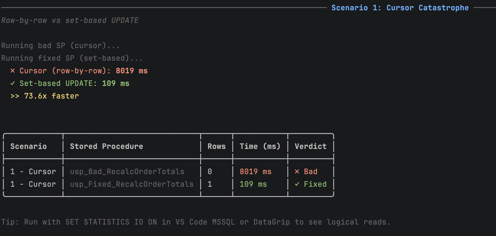
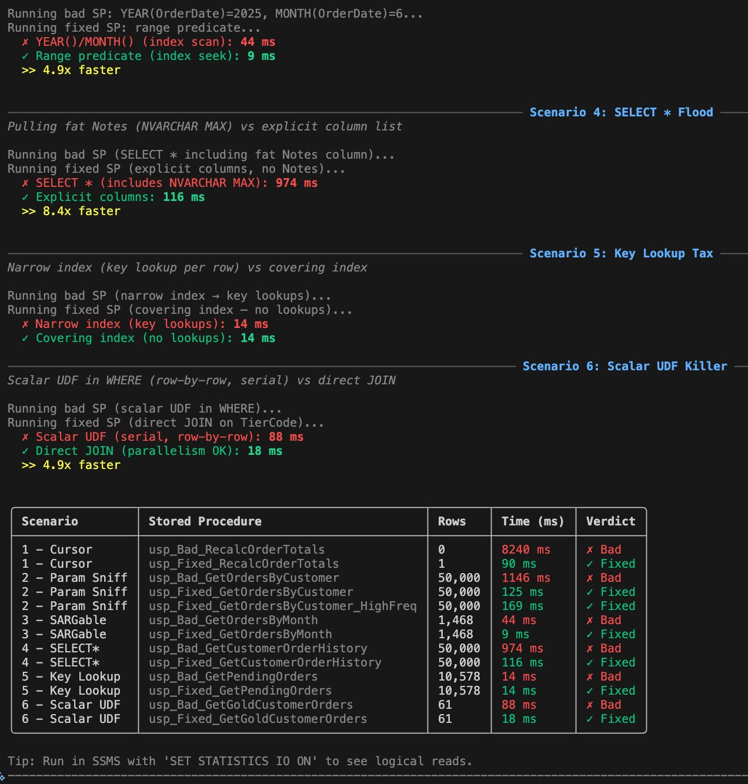
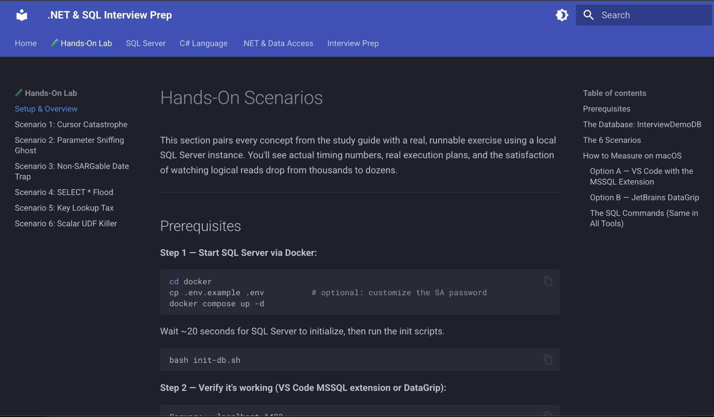
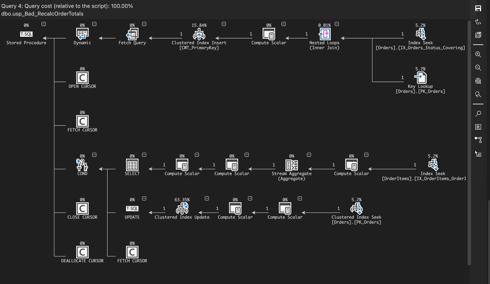

# .NET & SQL Interview Prep

A hands-on study lab for C# .NET + SQL Server interview prep. Includes a real Docker SQL Server, 6 intentionally broken stored procedures, and a C# console app to benchmark them.

---

## In Action

**C# benchmark app — `dotnet run -- all`**

> Scenario 1: Cursor loop vs set-based UPDATE



> Scenario 2: Parameter sniffing — plan cached for the wrong customer shape


> All 6 scenarios in one run



**MkDocs docs site — `mkdocs serve`**



**VS Code MSSQL — actual execution plan**



---

## Quick Start

### 1. Spin up SQL Server

```bash
cd docker
cp .env.example .env       # optional: change SA password
docker compose up -d
bash init-db.sh            # creates DB, all tables, seed data, and stored procs
```

### 2. Connect with a SQL client

```
Server:   localhost,1433
Login:    sa
Password: InterviewDemo@2026
Database: InterviewDemoDB
```

**On macOS** — pick either of these (both support graphical execution plans):

| Tool | Notes |
|---|---|
| **VS Code + MSSQL extension** | Install `ms-mssql.mssql` from the Extensions panel. Run queries, view graphical execution plans, and see `STATISTICS IO` output — all without leaving VS Code. Free. |
| **JetBrains DataGrip** | Full-featured SQL IDE with the best visual execution plan + **Explain Analyzed** view (actual row counts). Paid, but has a free trial. |

> **Note for Apple Silicon (M1/M2/M3/M4):** The `docker-compose.yml` already uses `mcr.microsoft.com/azure-sql-edge`, the ARM64-compatible image. No changes needed — it works natively on Apple Silicon.

> **Note:** Azure Data Studio was retired on February 28, 2026. Use VS Code with the MSSQL extension instead.

### 3. Run the C# benchmark app

```bash
cd src/SqlDemos
dotnet run              # interactive scenario menu
dotnet run -- all       # benchmark all 6 bad vs fixed proc pairs
dotnet run -- 2         # scenario 2 only (parameter sniffing)
```

### 4. Run the benchmark API

The `src/SqlDemosApi/` project is a **.NET 10 ASP.NET Core Minimal API** that exposes the same benchmarks as JSON endpoints. Open the Scalar UI to explore and run scenarios from your browser:

```bash
cd src/SqlDemosApi
dotnet run
# → http://localhost:5000/scalar   (Scalar OpenAPI UI)
# → GET http://localhost:5000/scenarios/all
# → GET http://localhost:5000/scenarios/1
```

Import `postman/SqlDemosApi.postman_collection.json` into Postman to get pre-built requests for every endpoint.

### 5. Deploy to Kubernetes with Terraform + Helm (optional)

One `terraform apply` deploys **both** the SQL Server and the API to Kubernetes — including building the Docker image automatically. Inline `# AWS DIFFERENCE:` comments show what changes for AWS EKS:

```bash
cd terraform
cp terraform.tfvars.example terraform.tfvars  # set sa_password
terraform init    # downloads kubernetes + helm + null providers
terraform apply   # builds image → deploys sql-server → deploys sql-demos-api

# Seed the database via NodePort 31433
SERVER="localhost,31433" bash docker/init-db.sh

# API is now live at:
# http://localhost:30080/scalar
```

See the [Kubernetes + Terraform + Helm guide](https://taylorbobaylor.github.io/dotnet-sql-learning/infrastructure/kubernetes/) for the full walkthrough and AWS EKS differences, and [CI/CD Pipelines](https://taylorbobaylor.github.io/dotnet-sql-learning/infrastructure/cicd/) for the GitHub Actions workflows.

### 6. Browse the docs site

The full docs are live at **[taylorbobaylor.github.io/dotnet-sql-learning](https://taylorbobaylor.github.io/dotnet-sql-learning/)** — no local setup needed.

To run them locally instead:

```bash
pip install mkdocs-material
mkdocs serve
```

Open [http://localhost:8000](http://localhost:8000)

---

## The 6 Hands-On Scenarios

| # | Name | Antipattern | Fix |
|---|---|---|---|
| 1 | Cursor Catastrophe | Cursor loop UPDATE | Set-based UPDATE |
| 2 | Parameter Sniffing Ghost | Plan cached for wrong params | `OPTION(RECOMPILE)` / `OPTIMIZE FOR UNKNOWN` |
| 3 | Non-SARGable Date Trap | `YEAR(OrderDate)` in WHERE | Range predicate |
| 4 | SELECT * Flood | Pulling NVARCHAR(MAX) | Explicit column list |
| 5 | Key Lookup Tax | Narrow nonclustered index | Covering index with INCLUDE |
| 6 | Scalar UDF Killer | Scalar function in WHERE | Direct JOIN |

---

## Topics Covered (Docs Site)

- **Hands-On Lab:** 6 scenarios with Docker SQL Server + C# benchmarks
- **SQL Server:** Joins, Stored Procedures, Indexes, Query Optimization, Execution Plans, Parameter Sniffing
- **C#:** Async/Await, SOLID Principles, Dependency Injection, Generics & LINQ
- **.NET Data Access:** Entity Framework Core, Dapper, Calling Stored Procedures
- **Interview Prep:** Game plan, Quick Reference Card, Top Q&A
- **Infrastructure & CI/CD:** Kubernetes via Terraform + Helm (Docker Desktop → AWS EKS), GitHub Actions pipelines

---

## Project Structure

```
dotnet-sql-learning/
├── terraform/
│   ├── main.tf                  kubernetes + helm providers + helm_release resource
│   ├── variables.tf             Input variables (namespace, password, storage, port)
│   ├── outputs.tf               Connection string, sqlcmd helper, helm status
│   └── terraform.tfvars.example Copy to terraform.tfvars — gitignored
├── helm/
│   ├── sql-server/              SQL Server chart (Secret, PVC, Deployment, Service)
│   └── sql-demos-api/           API chart (Deployment + NodePort Service)
│       └── templates/           deployment.yaml, service.yaml, secret.yaml
├── Dockerfile                   Multi-stage build for sql-demos-api
├── postman/
│   └── SqlDemosApi.postman_collection.json  Import into Postman for instant testing
├── docker/
│   ├── docker-compose.yml       SQL Server 2022 container
│   ├── .env.example             SA password config
│   ├── init-db.sh               One-shot init script runner
│   └── init/
│       ├── 01-create-database.sql
│       ├── 02-create-tables.sql
│       ├── 03-seed-data.sql     ~55k orders, intentionally skewed
│       ├── 04-indexes-baseline.sql
│       ├── 05-bad-stored-procs.sql   ← The villains
│       └── 06-fixed-stored-procs.sql ← The heroes
├── src/
│   ├── SqlDemos/                C# console app — interactive benchmarks (local dev)
│   └── SqlDemosApi/             ASP.NET Core Minimal API — benchmarks as JSON endpoints
├── docs/
│   ├── hands-on/                Scenario walkthroughs
│   ├── sql/                     SQL Server reference
│   ├── csharp/                  C# language topics
│   ├── dotnet/                  EF Core, Dapper, stored procs
│   ├── interview-prep/          Game plan, Q&A, cheat sheet
│   └── infrastructure/          Kubernetes (Terraform+Helm) + CI/CD pipelines
└── mkdocs.yml
```
