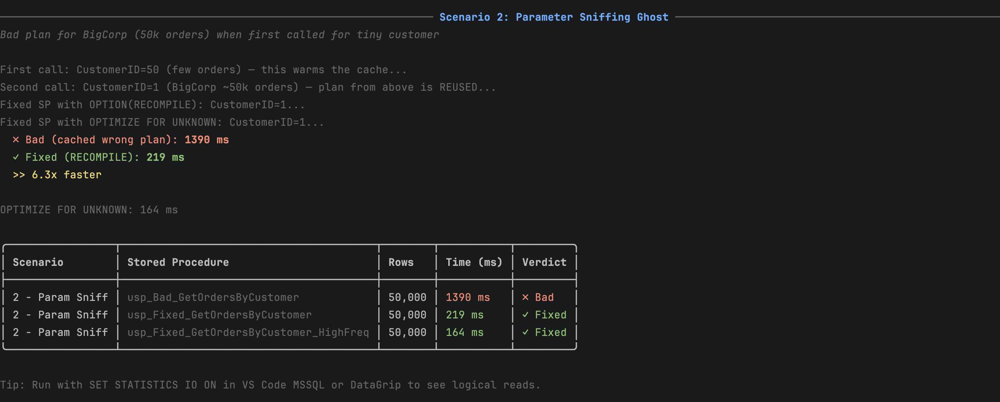

# Scenario 2: The Parameter Sniffing Ghost

> **Antipattern:** SQL Server builds a plan for one parameter value and caches it for everyone.
> **Symptom:** "Works for most users, but crashes for BigCorp" — or vice versa.
> **Fix:** `OPTION (RECOMPILE)` for infrequent calls; `OPTIMIZE FOR UNKNOWN` for frequent.

---

## The Story

Every customer-facing API call goes through `usp_GetOrdersByCustomer`. For 999 of 1,000 customers it returns in 50ms. For BigCorp (CustomerID=1, with 50,000+ orders), it takes 45 seconds. No code changes were made. It just... happened one day after a SQL Server restart.

Here's what actually happened:

1. After the restart, the first call was from Customer #83 (12 orders). SQL Server built a **Nested Loops** plan — optimal for tiny result sets.
2. That plan was cached.
3. BigCorp called the same SP. SQL Server **reused the cached plan** — Nested Loops iterating 50,000 times. Disaster.

The fix requires zero changes to application code.

---

## The Bad SP

```sql
CREATE OR ALTER PROCEDURE dbo.usp_Bad_GetOrdersByCustomer
    @CustomerID INT
AS
BEGIN
    SET NOCOUNT ON;

    -- ❌ No plan hint — whatever plan was cached first wins forever
    SELECT o.OrderID, o.OrderDate, o.Status, o.TotalAmount, o.Notes
    FROM dbo.Orders o
    WHERE o.CustomerID = @CustomerID
    ORDER BY o.OrderDate DESC;
END;
```

---

## The Exercise

This requires running in a specific order to reproduce the sniffing. **Do exactly this:**

**Step 1:** Clear the plan cache for this procedure (simulates a SQL Server restart):

```sql
DECLARE @handle VARBINARY(64);
SELECT @handle = plan_handle
FROM sys.dm_exec_procedure_stats
WHERE OBJECT_NAME(object_id) = 'usp_Bad_GetOrdersByCustomer';

IF @handle IS NOT NULL
    DBCC FREEPROCCACHE(@handle);
```

**Step 2:** Enable statistics and actual execution plan, then run with a **small customer first**:

```sql
SET STATISTICS IO ON;
SET STATISTICS TIME ON;
```

Enable the actual plan **before** running:

| Tool | How to enable actual execution plan |
|---|---|
| **VS Code MSSQL** | Right-click → **"Run Query with Actual Execution Plan"** |
| **DataGrip** | Right-click → **Explain Plan → Explain Analyzed** |

```sql
EXEC dbo.usp_Bad_GetOrdersByCustomer @CustomerID = 83;  -- small customer, poisons cache
```

Open the Execution Plan tab. Note the join type: **Nested Loops**. Check Messages/Output for logical reads (small number).

**Step 3:** Now run for BigCorp **without clearing the cache**:

```sql
EXEC dbo.usp_Bad_GetOrdersByCustomer @CustomerID = 1;  -- BigCorp
```

The plan tab will still show **Nested Loops** — the cached plan from the small customer is being reused for 50,000 rows. Watch logical reads spike dramatically. In the plan, hover the join operator to see the row count tooltip:

```
Estimated Rows:  12
Actual Rows:     50,847
```

That mismatch is the smoking gun.

**Step 4:** Run the fixed SP for comparison:

```sql
EXEC dbo.usp_Fixed_GetOrdersByCustomer @CustomerID = 1;          -- RECOMPILE
EXEC dbo.usp_Fixed_GetOrdersByCustomer_HighFreq @CustomerID = 1; -- OPTIMIZE FOR UNKNOWN
```

---

## Detecting Parameter Sniffing in the Plan

Look for these signs in the actual execution plan:

```
Estimated Rows:  12
Actual Rows:     50,847
```

That mismatch on a JOIN operator is the telltale sign. SQL Server thought it was joining 12 rows (from customer 83's cached plan statistics), but got 50,000.

You can also query the plan cache directly:

```sql
SELECT
    ps.execution_count,
    ps.total_logical_reads,
    ps.total_elapsed_time / 1000 AS total_elapsed_ms,
    -- The value the plan was compiled for:
    TRY_CAST(qp.query_plan AS XML).value(
        '(//ParameterList/ColumnReference[@Column="@CustomerID"]/@ParameterCompiledValue)[1]',
        'NVARCHAR(50)') AS sniffed_customer_id
FROM sys.dm_exec_procedure_stats ps
CROSS APPLY sys.dm_exec_query_plan(ps.plan_handle) qp
WHERE OBJECT_NAME(ps.object_id) = 'usp_Bad_GetOrdersByCustomer';
```

---

## The Three Fixes

### Fix A — `OPTION (RECOMPILE)` (Best for infrequent, variable calls)

```sql
SELECT o.OrderID, o.OrderDate, o.Status, o.TotalAmount, o.ShipCity
FROM dbo.Orders o
WHERE o.CustomerID = @CustomerID
ORDER BY o.OrderDate DESC
OPTION (RECOMPILE);  -- Fresh optimal plan every single time
```

**Pro:** Always optimal. **Con:** CPU cost per call (plan compilation).

### Fix B — `OPTION (OPTIMIZE FOR UNKNOWN)` (Best for high-frequency calls)

```sql
SELECT o.OrderID, o.OrderDate, o.Status, o.TotalAmount, o.ShipCity
FROM dbo.Orders o
WHERE o.CustomerID = @CustomerID
ORDER BY o.OrderDate DESC
OPTION (OPTIMIZE FOR (@CustomerID UNKNOWN));  -- Use average statistics
```

**Pro:** Plan is cached (low overhead). **Con:** Plan is a compromise — not optimal for extremes.

### Fix C — Local variable trick (no hint syntax needed)

```sql
DECLARE @LocalID INT = @CustomerID;  -- SQL Server can't sniff this
SELECT ...
WHERE o.CustomerID = @LocalID
```

Same effect as `OPTIMIZE FOR UNKNOWN`. Good when you can't change query hints (legacy code, ORMs).

---

## Decision Tree

```
Is the SP called very frequently (100+ times/sec)?
├── YES → OPTIMIZE FOR UNKNOWN or local variable
└── NO  → OPTION(RECOMPILE) — simplest, always optimal

Is data distribution wildly variable (1 row vs 50,000)?
├── YES → OPTION(RECOMPILE) — the variance makes it worth recompiling
└── NO  → OPTIMIZE FOR UNKNOWN is fine
```

---

## Benchmark Result

Running `dotnet run -- 2` warms the cache with a small customer first, then hits BigCorp — you can see the cached bad plan vs the fixed plan:



---

## Interview Answer

> "Parameter sniffing happens when SQL Server builds an execution plan for a stored procedure based on the first parameter values it sees, caches it, and then reuses it for all subsequent calls — even when those calls have parameters with totally different data characteristics. The classic sign is 'fast for most users, crawls for one big customer.' In the execution plan you'll see a huge mismatch between estimated and actual row counts. My fix depends on call frequency — for a low-frequency SP I'll add `OPTION(RECOMPILE)` to get a fresh plan every time. For a high-frequency call I'll use `OPTION(OPTIMIZE FOR UNKNOWN)` so we get a cached plan based on average statistics rather than an outlier value."
